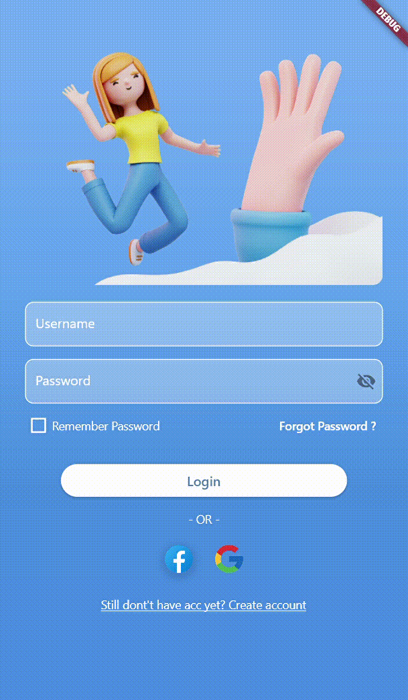

# Tugas Pemograman Mobile 2
## Profil
| #               | Biodata              |
| --------------- | ---------------------|
| **Nama**        | Bilal AlHafidz       |
| **NIM**         | 312110397            |
| **Kelas**       | TI.21.A.1            |
| **Mata Kuliah** | Pemrograman Mobile 2 |

## Tutorial dan Penjelasan

1. Pertama, import package `'flutter/material.dart'` yang diperlukan untuk mengembangkan aplikasi Flutter dengan tampilan Material Design.

2. Kemudian, definisikan fungsi main() sebagai entry point dari aplikasi Flutter. Di dalam fungsi ini, kita menjalankan aplikasi LoginApp().

3. Kelas `LoginApp` merupakan kelas StatelessWidget yang inheritance dari kelas StatelessWidget pada Flutter. Pada method build(), kita mengembalikan `MaterialApp` sebagai root widget aplikasi. `MaterialApp` adalah kelas yang menyediakan konfigurasi dasar untuk aplikasi Flutter, seperti judul, tema, dan routing.

4. Di dalam `MaterialApp`, definisikan title aplikasi dan tema dengan primarySwatch Colors.blue.

5. Selanjutnya, kita menetapkan LoginPage sebagai halaman awal (home) dengan menggunakan `home: LoginPage()`.

6. Selain itu, kita juga mendefinisikan routing untuk halaman 'forgot_password' dengan menggunakan `routes: {'/forgot_password': (context) => ForgotPasswordPage()}`.

7. Kelas `LoginPage` adalah StatefulWidget yang inheritance dari kelas StatefulWidget pada Flutter. Ini berarti bahwa halaman ini dapat memiliki state yang berubah.

8. Kelas `_LoginPageState` adalah state dari LoginPage. Di dalam kelas ini, kita mendefinisikan beberapa variabel seperti accountList, selectedAccount, _rememberPassword, dan _passwordVisible. Variabel ini digunakan untuk menyimpan informasi akun, akun yang dipilih, status checkbox "Remember Password", dan status visibilitas password.

9. Selanjutnya, kita menggunakan `TextEditingController` untuk mengontrol input teks pada field username, password, createUsername, createPassword, dan confirmPassword.

10. kita juga menggunakan `GlobalKey<FormState>` untuk validasi form.

11. Selanjutnya, pada method build() LoginPage, kita menggunakan Scaffold sebagai root widget. Scaffold adalah kelas yang menyediakan struktur dasar untuk tata letak aplikasi seperti AppBar dan body.

12. Pada body, kita menggunakan LayoutBuilder untuk mengatur tata letak aplikasi sesuai dengan batasan yang diberikan oleh `BoxConstraints`.

13. Di dalam Container, kita menggunakan gradient untuk mengatur latar belakang dengan efek gradasi menggunakan `LinearGradient`. Container ini berisi SingleChildScrollView, yang memungkinkan konten dalam halaman dapat di-scroll jika terlalu panjang.

14. Di dalam `SingleChildScrollView`, kita memiliki Container yang berisi logo, form login, dan tombol login.

15. Form login menggunakan Form dan `TextFormField` untuk mengontrol input pada field username dan password. `TextFormField` ini juga dapat menerapkan validasi dan mengambil kontrol terhadap perubahan nilai.

16. Pada `TextFormField` untuk password, kita juga menambahkan IconButton sebagai sufficIcon untuk mengontrol visibilitas password.

17. Kemudian, kita memiliki Checkbox untuk mengontrol status _rememberPassword. Jika checkbox diubah, kita memperbarui status dengan menggunakan setState().

18. Di bagian bawah form login, ada ElevatedButton yang digunakan untuk proses login. Ketika tombol ini ditekan, kita memvalidasi form menggunakan `_formKey.currentState!.validate()`. Jika form valid, kita memeriksa apakah akun yang dipilih dan kata sandi sesuai dengan yang tersimpan dalam `accountList`. Jika validasi berhasil, kita mencetak pesan "Login successful: username" ke konsol. Jika tidak, kita mencetak pesan "Invalid username or password" ke konsol.

19. Pada `AppBar`, kita menampilkan judul aplikasi "Login App" yang telah ditentukan sebelumnya.

20. Selain itu, kita juga menambahkan IconButton dengan ikon 'help' untuk menampilkan snackbar ketika ikon tersebut diklik. Snackbar ini akan menampilkan pesan bantuan kepada pengguna.

21. Setelah selesai mengimplementasikan LoginPage, kita juga dapat melihat bahwa terdapat kelas `ForgotPasswordPage` yang ditentukan sebagai halaman `'/forgot_password'`. Kelas ini mirip dengan LoginPage, hanya dengan perbedaan desain tampilan dan logika terkait lupa kata sandi.

22. Dalam kelas ForgotPasswordPage, kita juga menggunakan TextEditingController untuk mengontrol input teks pada field email.

23. Pada method build() ForgotPasswordPage, kita menggunakan Scaffold sebagai root widget. Scaffold ini juga memiliki AppBar dan body yang mirip dengan LoginPage.

24. Di dalam body, kita menggunakan Column sebagai widget yang memungkinkan kita untuk menampilkan beberapa widget secara vertikal.

25. Di dalam Column, kita memiliki TextFormField untuk memasukkan alamat email pengguna yang terkait dengan akun yang lupa kata sandi.

26. Di bagian bawah, kita memiliki ElevatedButton yang digunakan untuk mengirim email pemulihan kata sandi. Ketika tombol ini ditekan, kita mencetak pesan "Password recovery email sent to: email" ke konsol.

27. Sekarang, setelah kita mengetahui struktur dan logika di balik kode ini, kita dapat menjalankan aplikasi Flutter dengan menjalankan perintah `flutter run` pada terminal.

Itulah tutorial langkah demi langkah untuk menjelaskan alur program Flutter di atas. Dengan mengikuti langkah-langkah ini, kita dapat memahami bagaimana aplikasi ini dibangun dan berinteraksi dengan pengguna.

### Output

## Terima Kasih!